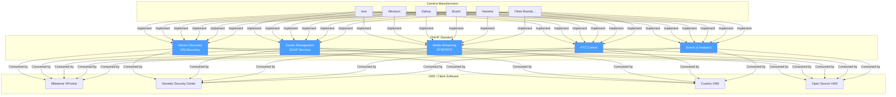

# What is ONVIF?

## Overview

**ONVIF** (Open Network Video Interface Forum) is a global, open industry standard that defines a common protocol for IP-based physical security products. Founded in 2008 by Axis Communications, Bosch Security Systems, and Sony, ONVIF provides a standardized interface for how IP cameras, video management software (VMS), and other security devices communicate with each other.

At its core, ONVIF is a set of SOAP-based web service specifications that allow any ONVIF-conformant device to work with any ONVIF-conformant client -- regardless of manufacturer.

## The Problem: Vendor Lock-In

Before ONVIF, the IP surveillance industry suffered from severe fragmentation:

- **Every camera manufacturer** had their own proprietary SDK and API
- **VMS developers** had to write separate integration code for each camera brand
- **End users** were locked into a single vendor's ecosystem
- **Adding a new camera brand** to a VMS could take months of development
- **Firmware updates** could break existing integrations

This created a situation where:
- A VMS supporting 50 camera brands needed 50 separate integration modules
- Each integration had to be maintained independently
- Small VMS companies could not compete because they lacked resources to integrate with enough brands
- Camera manufacturers had to provide SDKs and support for every VMS vendor

## How ONVIF Solves This

ONVIF provides a single, standardized interface that all conformant devices implement:

```
Before ONVIF:
  Camera Brand A  ──[SDK A]──►  VMS
  Camera Brand B  ──[SDK B]──►  VMS  (each needs custom integration)
  Camera Brand C  ──[SDK C]──►  VMS

After ONVIF:
  Camera Brand A  ──┐
  Camera Brand B  ──┤──[ONVIF]──►  VMS  (one integration works for all)
  Camera Brand C  ──┘
```

### Key Benefits

1. **Interoperability**: Any ONVIF-conformant camera works with any ONVIF-conformant VMS
2. **Reduced Development Cost**: Write one ONVIF client instead of dozens of proprietary integrations
3. **Future-Proof**: New cameras automatically work if they support ONVIF
4. **Vendor Independence**: End users can mix and match cameras from different manufacturers
5. **Standardized Discovery**: Cameras can be auto-discovered on the network using WS-Discovery

## ONVIF vs Proprietary SDKs

| Aspect | ONVIF | Proprietary SDK |
|--------|-------|-----------------|
| **Protocol** | SOAP/XML over HTTP(S) | Varies (binary, REST, custom TCP) |
| **Discovery** | WS-Discovery (standardized) | Vendor-specific broadcast |
| **Authentication** | WS-UsernameToken (standardized) | Varies per vendor |
| **Streaming** | RTSP/RTP (standardized) | Mostly RTSP, but setup varies |
| **PTZ Control** | Standardized commands | Vendor-specific commands |
| **Event System** | WS-BaseNotification | Proprietary event systems |
| **Camera Support** | Any ONVIF camera | Only that vendor's cameras |
| **Development Effort** | One integration | One per vendor |
| **Feature Coverage** | Common features standardized | Full vendor-specific features |
| **Maintenance** | Standards-based, stable | Depends on vendor SDK updates |
| **Advanced Features** | May not cover vendor-specific extras | Full access to proprietary features |

> **Important**: In practice, most professional VMS systems use ONVIF for discovery and basic setup, then switch to proprietary SDKs for advanced features when available. ONVIF is the universal baseline; proprietary integrations add the extras.

## Real-World Impact

ONVIF has fundamentally changed the surveillance industry:

- **Over 20,000 ONVIF-conformant products** exist across hundreds of manufacturers
- **Major brands** like Hikvision, Dahua, Axis, Bosch, Hanwha, and many more all support ONVIF
- **VMS platforms** like Milestone, Genetec, and open-source solutions like ZoneMinder support ONVIF
- A VMS developer can support **thousands of camera models** with a single ONVIF implementation

## ONVIF Ecosystem Diagram



## What ONVIF Covers

ONVIF standardizes the following operations:

| Category | Operations |
|----------|-----------|
| **Discovery** | Auto-detect cameras on the network |
| **Device Management** | Get device info, set hostname, manage users, firmware upgrade |
| **Media Configuration** | Configure video/audio profiles, encoding settings |
| **Streaming** | Get RTSP stream URIs, start/stop streaming |
| **PTZ** | Pan, tilt, zoom control with presets and tours |
| **Events** | Motion detection events, analytics alerts, alarm triggers |
| **Recording** | NVR recording control, playback, export |
| **Access Control** | Door control, credential management |
| **Analytics** | Video analytics metadata, object detection |

## What ONVIF Does NOT Cover

- Vendor-specific AI features (face recognition algorithms, etc.)
- Proprietary compression codecs
- Cloud service integrations
- Mobile app push notifications
- Vendor-specific storage formats

## Summary

For VMS developers, ONVIF is the essential starting point for IP camera integration. It provides:

1. **Discovery**: Find cameras on the network automatically
2. **Configuration**: Set up video profiles and encoding parameters
3. **Streaming**: Obtain RTSP URIs for live and recorded video
4. **Control**: Pan-tilt-zoom, events, and recording management

By implementing ONVIF once, your VMS can work with any conformant camera out of the box. This tutorial will guide you through implementing each of these capabilities in Go.
