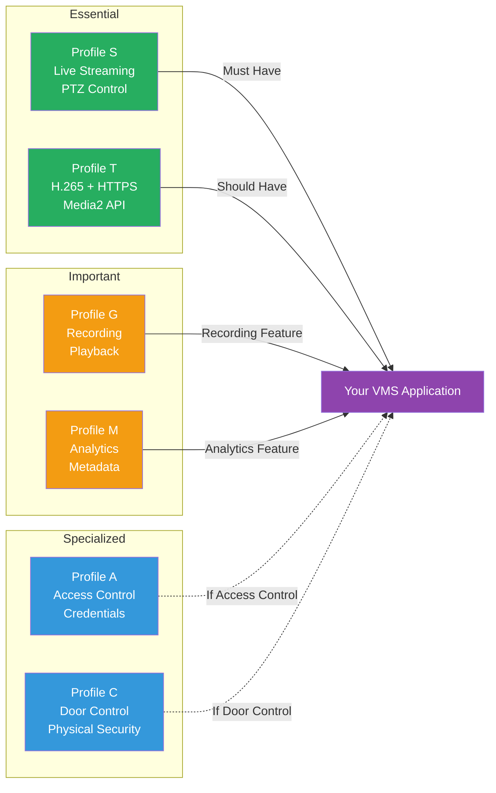

# ONVIF Profiles

## What Are ONVIF Profiles?

ONVIF Profiles define a minimum set of features that a conformant device or client must support for a particular use case. Think of profiles as "feature bundles" -- a camera that claims Profile S conformance guarantees it supports a specific set of streaming, PTZ, and media capabilities.

Profiles solve a practical problem: ONVIF specifications cover hundreds of features, but not every device needs to implement all of them. Profiles define which features are mandatory for specific use cases, giving VMS developers a reliable baseline to code against.

## Profile Overview

### Profile S -- Streaming (2011)

**Purpose**: Live video streaming, audio, PTZ, and multicasting.

Profile S is the most widely adopted ONVIF profile and the one most relevant to VMS developers. Almost every ONVIF camera supports Profile S.

**Mandatory Features**:
- Video streaming via RTSP/RTP
- Video encoder configuration (H.264 at minimum)
- Media profile management
- PTZ control (if device has PTZ capability)
- WS-Discovery for device detection
- User authentication (WS-UsernameToken)

**Optional Features**:
- Audio streaming
- Multicast streaming
- Relay outputs (for alarm triggers)
- PTZ presets and preset tours

**VMS Relevance**: This is the profile you will implement first. It covers the core workflow: discover camera, authenticate, get stream URI, display video.

---

### Profile T -- Advanced Streaming (2019)

**Purpose**: H.265 video, HTTPS streaming, metadata streaming, and imaging settings.

Profile T extends Profile S with modern codec and security requirements. It was introduced to address the growing adoption of H.265/HEVC and the need for encrypted transport.

**Key Additions Over Profile S**:
- H.265 (HEVC) video encoding support
- HTTPS transport for secure streaming
- Metadata streaming (on-screen display, analytics events)
- Imaging service (brightness, contrast, exposure, focus, IR settings)
- Media2 service (newer API replacing the original Media service)
- Motion region configuration

**VMS Relevance**: Essential for modern VMS systems that need H.265 support and secure streaming. The Media2 service introduced in Profile T is the recommended API going forward.

---

### Profile G -- Recording and Storage (2014)

**Purpose**: Edge storage, recording, search, and playback.

Profile G covers NVR (Network Video Recorder) functionality and cameras with built-in SD card recording.

**Mandatory Features**:
- Recording control (start/stop)
- Recording search (find recordings by time range)
- Playback via RTSP (with seek, fast-forward, reverse)
- Recording configuration
- Edge storage management (SD card)

**VMS Relevance**: Critical for VMS systems that need to access camera-side recordings, play back stored footage, or manage edge storage. This profile enables "pull-from-camera" recording architectures.

---

### Profile A -- Access Control (2016)

**Purpose**: Access control configuration and management.

Profile A covers electronic access control systems -- door readers, card systems, and access credentials.

**Mandatory Features**:
- Access point information (doors, gates)
- Credential management (access cards, PINs)
- Access rules and schedules
- Access control events (door opened, access denied)

**VMS Relevance**: Relevant for unified security platforms that integrate video surveillance with access control. Allows VMS to display "door opened" events alongside camera video of the door.

---

### Profile C -- Physical Security (2014)

**Purpose**: Door control and status monitoring.

Profile C is complementary to Profile A, focusing on the physical door control aspect rather than credential management.

**Mandatory Features**:
- Door control (lock/unlock/block)
- Door status monitoring (open/closed/locked)
- Door mode management (locked, unlocked, access controlled)

**VMS Relevance**: Used in conjunction with Profile A for full access control integration. Enables a VMS to lock/unlock doors remotely via the camera/controller interface.

---

### Profile M -- Metadata and Events for Analytics (2022)

**Purpose**: Metadata streaming and analytics event handling.

Profile M is the newest profile, addressing the growing demand for video analytics and AI-powered features.

**Mandatory Features**:
- Analytics metadata streaming (bounding boxes, object classification)
- Event handling for analytics
- Metadata configuration
- General object classification (human, vehicle, face, license plate)

**VMS Relevance**: Increasingly important for modern VMS systems that display analytics overlays (bounding boxes around detected objects), trigger recording on analytics events, or feed metadata to third-party AI systems.

---

### Profile D -- Peripheral Devices (2024)

**Purpose**: Access control peripherals like card readers and biometric devices.

Profile D extends the access control profiles with support for peripheral device management.

---

### Profile Q -- Quick Install (Deprecated)

**Purpose**: Was designed for easy out-of-box camera setup and discovery. **Deprecated as of April 2022** and should not be used for new implementations.

## Profile Comparison Table

| Feature | S | T | G | A | C | M |
|---------|---|---|---|---|---|---|
| **Live Streaming** | Yes | Yes | - | - | - | - |
| **H.264** | Yes | Yes | - | - | - | - |
| **H.265** | - | Yes | - | - | - | - |
| **HTTPS Streaming** | - | Yes | - | - | - | - |
| **PTZ** | Yes | Yes | - | - | - | - |
| **Audio** | Optional | Optional | - | - | - | - |
| **Recording Control** | - | - | Yes | - | - | - |
| **Playback** | - | - | Yes | - | - | - |
| **Edge Storage** | - | - | Yes | - | - | - |
| **Imaging (Exposure, IR)** | - | Yes | - | - | - | - |
| **Metadata Streaming** | - | Yes | - | - | - | Yes |
| **Analytics Events** | - | - | - | - | - | Yes |
| **Object Classification** | - | - | - | - | - | Yes |
| **Access Credentials** | - | - | - | Yes | - | - |
| **Door Control** | - | - | - | - | Yes | - |
| **Media2 Service** | - | Yes | - | - | - | - |

## Which Profiles Matter for VMS Development?

## Implementation Priority for VMS Developers

For a VMS developer building ONVIF support, the recommended implementation order is:

1. **Profile S** -- Get live streaming working first. This is the foundation.
2. **Profile T** -- Add H.265 support and switch to Media2 service API.
3. **Profile G** -- Add recording playback to access camera-side stored footage.
4. **Profile M** -- Add analytics metadata overlays and event-driven recording.
5. **Profile A/C** -- Only if your VMS integrates physical access control.

## Profile Conformance Levels

Each profile defines two conformance levels:

- **Device Conformance**: The camera/device implements the required ONVIF services
- **Client Conformance**: The VMS/client can consume and use those services

A device can conform to multiple profiles simultaneously. Most modern IP cameras support both Profile S and Profile T.

## How to Check a Camera's Profile Support

During ONVIF device discovery and initial connection, you can query which profiles a camera supports:

1. **WS-Discovery**: The device's discovery response includes its scopes, which list supported profiles (e.g., `onvif://www.onvif.org/Profile/Streaming`)
2. **GetServices / GetCapabilities**: After connecting, query the device's capabilities to confirm supported services and profiles

This information helps your VMS adapt its behavior -- for example, using Media2 service if Profile T is supported, or falling back to the original Media service for Profile S-only devices.

## References

- [ONVIF Profile Feature Overview (PDF)](../docs/specs/ONVIF-Profile-Feature-Overview.pdf)
- [ONVIF Profiles Page](https://www.onvif.org/profiles/)
- [ONVIF Conformant Products](https://www.onvif.org/conformant-products/)
