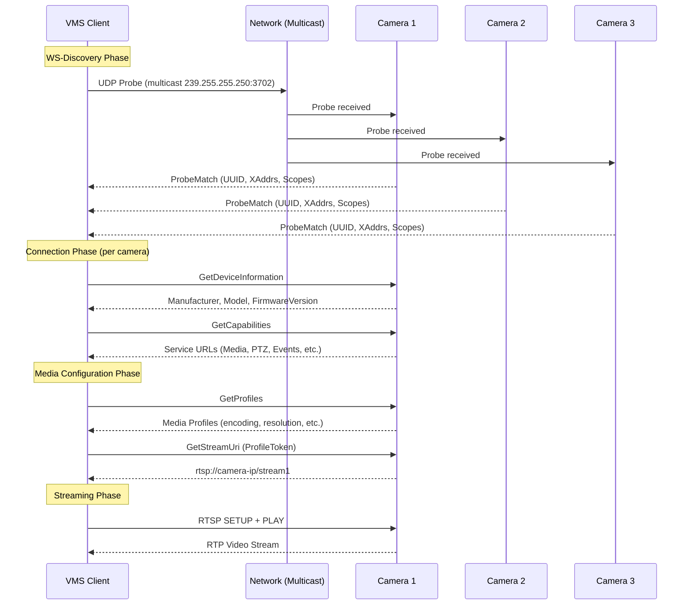
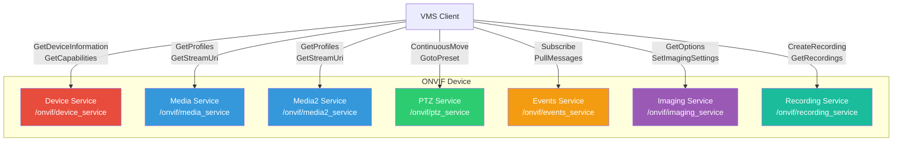
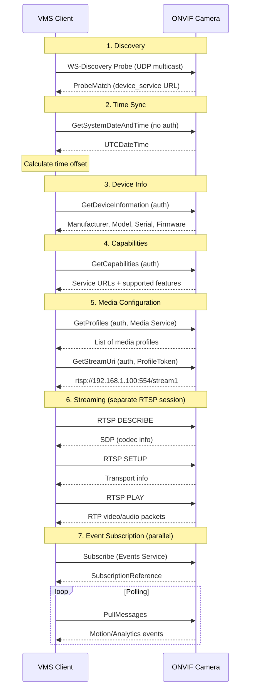

# ONVIF Architecture

## Foundation: SOAP and WSDL

ONVIF is built on **SOAP** (Simple Object Access Protocol) web services, defined by **WSDL** (Web Services Description Language) files. This is a deliberate architectural choice that provides:

- **Strongly typed interfaces**: Every request and response has a well-defined XML schema
- **Language-agnostic**: Any language with SOAP support can implement ONVIF
- **Self-describing**: WSDL files fully define the API contract
- **Standards-based**: Built on existing W3C standards (WS-Security, WS-Discovery, WS-Addressing)

### Why SOAP and Not REST?

ONVIF was designed in 2008 when SOAP was the dominant enterprise standard. While REST has since become more popular for web APIs, SOAP provides important benefits for device communication:

- **WS-Security**: Built-in security framework for authentication
- **WS-Discovery**: Standardized device discovery on local networks
- **WS-Addressing**: Message routing and correlation
- **Schema validation**: Compile-time type checking against WSDL

In practice, this means all ONVIF communication consists of XML messages sent over HTTP/HTTPS POST requests.

### Example SOAP Request

```xml
<?xml version="1.0" encoding="UTF-8"?>
<s:Envelope xmlns:s="http://www.w3.org/2003/05/soap-envelope"
            xmlns:trt="http://www.onvif.org/ver10/media/wsdl">
    <s:Header>
        <!-- WS-Security authentication header -->
    </s:Header>
    <s:Body>
        <trt:GetProfiles/>
    </s:Body>
</s:Envelope>
```

## WS-Discovery: Finding Cameras on the Network

WS-Discovery is the mechanism ONVIF uses to automatically detect devices on the local network. It works via UDP multicast -- no prior knowledge of camera IP addresses is needed.

### How WS-Discovery Works

1. **Client sends a Probe**: A UDP multicast message to `239.255.255.250:3702`
2. **Devices respond**: Each ONVIF device on the network sends a unicast response back
3. **Response contains**: Device UUID, service endpoint URL, and supported scopes (profiles)



### Discovery Message Example

**Probe (sent by VMS)**:
```xml
<?xml version="1.0" encoding="UTF-8"?>
<s:Envelope xmlns:s="http://www.w3.org/2003/05/soap-envelope"
            xmlns:a="http://schemas.xmlsoap.org/ws/2004/08/addressing"
            xmlns:d="http://schemas.xmlsoap.org/ws/2005/04/discovery">
    <s:Header>
        <a:Action>http://schemas.xmlsoap.org/ws/2005/04/discovery/Probe</a:Action>
        <a:MessageID>uuid:unique-id-here</a:MessageID>
        <a:To>urn:schemas-xmlsoap-org:ws:2005:04:discovery</a:To>
    </s:Header>
    <s:Body>
        <d:Probe>
            <d:Types>dn:NetworkVideoTransmitter</d:Types>
        </d:Probe>
    </s:Body>
</s:Envelope>
```

**ProbeMatch (sent by camera)**:
```xml
<d:ProbeMatch>
    <a:EndpointReference>
        <a:Address>urn:uuid:camera-unique-id</a:Address>
    </a:EndpointReference>
    <d:Types>dn:NetworkVideoTransmitter</d:Types>
    <d:Scopes>
        onvif://www.onvif.org/type/video_encoder
        onvif://www.onvif.org/Profile/Streaming
        onvif://www.onvif.org/name/CameraName
    </d:Scopes>
    <d:XAddrs>http://192.168.1.100/onvif/device_service</d:XAddrs>
</d:ProbeMatch>
```

## ONVIF Service Endpoints

Once a camera is discovered, it exposes multiple SOAP service endpoints. Each endpoint handles a specific domain of functionality. The `GetCapabilities` or `GetServices` call returns the URLs for each service.

### Core Services

| Service | Namespace | Purpose |
|---------|-----------|---------|
| **Device** | `http://www.onvif.org/ver10/device/wsdl` | Device management, system info, network config, users, time sync |
| **Media** | `http://www.onvif.org/ver10/media/wsdl` | Media profiles, encoding config, stream URIs (Profile S) |
| **Media2** | `http://www.onvif.org/ver20/media/wsdl` | Updated media service with H.265 support (Profile T) |
| **PTZ** | `http://www.onvif.org/ver20/ptz/wsdl` | Pan-tilt-zoom control, presets, preset tours |
| **Events** | `http://www.onvif.org/ver10/events/wsdl` | Event subscription, motion detection, analytics alerts |
| **Imaging** | `http://www.onvif.org/ver20/imaging/wsdl` | Camera image settings (brightness, contrast, exposure, IR) |

### Additional Services

| Service | Purpose |
|---------|---------|
| **Recording** | NVR recording control (Profile G) |
| **Search** | Search stored recordings by time, event, or metadata |
| **Replay** | Playback of stored recordings via RTSP |
| **Analytics** | Video analytics configuration |
| **AccessControl** | Access point and credential management (Profile A) |
| **DoorControl** | Physical door lock/unlock (Profile C) |

### Service Architecture Diagram



## ONVIF Authentication

ONVIF uses **WS-UsernameToken** for authentication, which is part of the WS-Security standard. This is different from basic HTTP authentication.

### How WS-UsernameToken Works

The authentication token is included in the SOAP header of every authenticated request:

```xml
<s:Header>
    <Security xmlns="http://docs.oasis-open.org/wss/2004/01/oasis-200401-wss-wssecurity-secext-1.0.xsd">
        <UsernameToken>
            <Username>admin</Username>
            <Password Type="...#PasswordDigest">BASE64(SHA1(nonce + created + password))</Password>
            <Nonce>BASE64(random_nonce)</Nonce>
            <Created>2024-01-15T10:30:00Z</Created>
        </UsernameToken>
    </Security>
</s:Header>
```

### Password Digest Calculation

The password is never sent in plain text. Instead, a digest is computed:

```
PasswordDigest = Base64(SHA-1(Nonce + Created + Password))
```

Where:
- **Nonce**: A random value generated for each request (prevents replay attacks)
- **Created**: UTC timestamp of the request (prevents old messages from being reused)
- **Password**: The user's password in plain text (only used locally for the hash)

This means the camera never receives the actual password -- it receives a hash that it can verify against its stored credentials by performing the same calculation.

### Authentication Levels

ONVIF defines different access levels:

| Level | Description | Typical Operations |
|-------|-------------|-------------------|
| **Anonymous** | No authentication required | WS-Discovery, GetSystemDateAndTime |
| **User** | Basic authenticated access | GetProfiles, GetStreamUri |
| **Operator** | Control access | PTZ control, relay outputs |
| **Administrator** | Full access | User management, network config, firmware upgrade |

### Time Synchronization Requirement

Because the `Created` timestamp is part of the digest, the VMS client and camera must have synchronized clocks. A typical ONVIF client workflow:

1. Call `GetSystemDateAndTime` (no auth required)
2. Calculate the time offset between client and camera
3. Use the camera's time reference when generating the `Created` field

If clocks are more than a few seconds apart, authentication will fail silently.

## Complete Connection Flow



## Typical Service Endpoint URLs

While not strictly standardized, most ONVIF cameras use similar URL patterns:

```
Device Service:    http://<ip>/onvif/device_service
Media Service:     http://<ip>/onvif/media_service
Media2 Service:    http://<ip>/onvif/media2_service
PTZ Service:       http://<ip>/onvif/ptz_service
Events Service:    http://<ip>/onvif/events_service
Imaging Service:   http://<ip>/onvif/imaging_service
Recording Service: http://<ip>/onvif/recording_service
```

> **Note**: Never hardcode these paths. Always use `GetCapabilities` or `GetServices` to discover the actual service URLs for each camera, as some manufacturers use different paths.

## References

- [ONVIF Core Specification](../docs/specs/ONVIF-Core-Specification.pdf)
- [ONVIF Media Service Specification](../docs/specs/ONVIF-Media-Service-Spec.pdf)
- [ONVIF PTZ Service Specification](../docs/specs/ONVIF-PTZ-Service-Spec.pdf)
- [ONVIF Streaming Specification](../docs/specs/ONVIF-Streaming-Spec.pdf)
- [WS-Discovery Specification](http://docs.oasis-open.org/ws-dd/discovery/1.1/os/wsdd-discovery-1.1-spec-os.html)
- [WS-Security UsernameToken Profile](http://docs.oasis-open.org/wss/v1.1/wss-v1.1-spec-os-UsernameTokenProfile.pdf)
