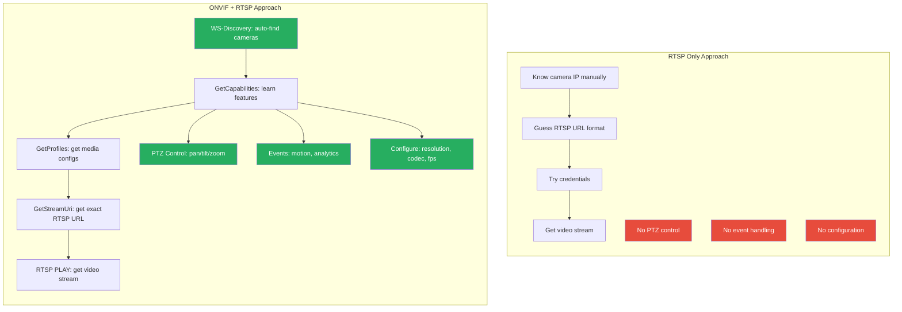
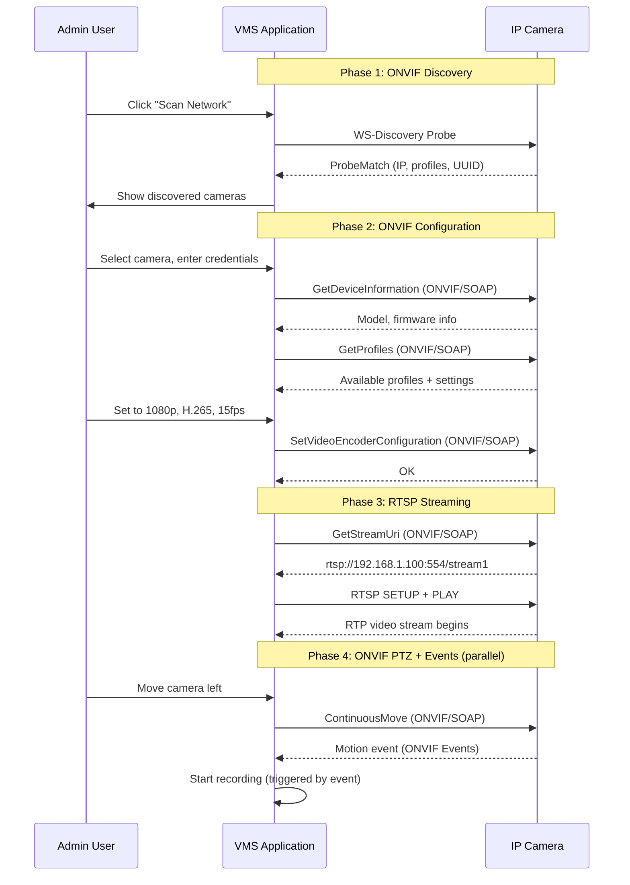

# ONVIF vs RTSP: Understanding the Difference

## The Common Misconception

A frequent question from developers new to IP camera integration is:

> "Why do I need ONVIF? Can't I just use RTSP to stream video from cameras?"

The short answer: **RTSP only handles streaming. ONVIF handles everything else** -- discovery, configuration, control, events, and more. RTSP is a transport protocol; ONVIF is a complete device management standard that *uses* RTSP for its streaming component.

## What RTSP Does

**RTSP** (Real Time Streaming Protocol) is a network control protocol designed for streaming media. It provides:

- **Stream setup**: Negotiate codec, transport (UDP/TCP), and ports
- **Playback control**: PLAY, PAUSE, TEARDOWN
- **Stream delivery**: Video and audio data via RTP (Real-time Transport Protocol)

To stream video from a camera using RTSP alone, you need to know:
1. The exact RTSP URL (varies by manufacturer)
2. The credentials (username/password)
3. The available streams (main stream, sub stream)

### The RTSP-Only Problem

With only RTSP, you face these challenges:

| Problem | Description |
|---------|-------------|
| **No discovery** | You must know the camera's IP address in advance |
| **URL guessing** | RTSP URLs differ per manufacturer (e.g., `/cam/realmonitor`, `/Streaming/Channels/101`, `/live/ch0`) |
| **No configuration** | Cannot change resolution, framerate, or encoding remotely |
| **No PTZ** | Cannot control pan-tilt-zoom |
| **No events** | Cannot receive motion detection or alarm events |
| **No device info** | Cannot query camera model, firmware, or capabilities |
| **No user management** | Cannot create/modify camera users |
| **No recording control** | Cannot manage on-camera recording |

## What ONVIF Adds

ONVIF wraps RTSP streaming with a complete management layer:



## Feature Comparison

| Capability | RTSP Only | ONVIF (+ RTSP) |
|-----------|-----------|-----------------|
| **Auto-discover cameras** | No | Yes (WS-Discovery) |
| **Get stream URL** | Must guess/hardcode | Programmatic via GetStreamUri |
| **Live video streaming** | Yes | Yes (via RTSP) |
| **Change resolution** | No | Yes (SetVideoEncoderConfiguration) |
| **Change codec** | No | Yes (H.264/H.265 selection) |
| **Change framerate** | No | Yes (SetVideoEncoderConfiguration) |
| **PTZ control** | No | Yes (ContinuousMove, AbsoluteMove, etc.) |
| **PTZ presets** | No | Yes (SetPreset, GotoPreset) |
| **Motion detection events** | No | Yes (Events service) |
| **Analytics metadata** | No | Yes (Profile M) |
| **Camera information** | No | Yes (GetDeviceInformation) |
| **User management** | No | Yes (CreateUsers, SetUser) |
| **Network configuration** | No | Yes (SetNetworkInterfaces) |
| **Recording control** | No | Yes (Profile G) |
| **Playback of recordings** | Only if you know the URL | Yes (GetReplayUri) |
| **Image settings** | No | Yes (Imaging service) |
| **Firmware upgrade** | No | Yes (Device service) |

## The RTSP URL Problem in Detail

This is one of the most practical reasons ONVIF matters. Consider the RTSP URLs for the same operation (main stream, channel 1) across different camera brands:

```
Hikvision:    rtsp://user:pass@ip:554/Streaming/Channels/101
Dahua:        rtsp://user:pass@ip:554/cam/realmonitor?channel=1&subtype=0
Axis:         rtsp://user:pass@ip:554/axis-media/media.amp
Bosch:        rtsp://user:pass@ip:554/video1
Samsung:      rtsp://user:pass@ip:554/profile2/media.smp
Uniview:      rtsp://user:pass@ip:554/media/video1
Reolink:      rtsp://user:pass@ip:554/h264Preview_01_main
Amcrest:      rtsp://user:pass@ip:554/cam/realmonitor?channel=1&subtype=0
```

With ONVIF, you never need to know any of these URLs. The workflow is:

```
1. GetProfiles()           --> Returns available media profiles
2. GetStreamUri(profile)   --> Returns the exact RTSP URL for this camera
```

The VMS code is identical regardless of camera brand.

## When RTSP-Only Is Acceptable

There are scenarios where RTSP-only integration is sufficient:

1. **Fixed, known camera setups**: A small installation with manually configured cameras where URLs are known
2. **Simple display applications**: Kiosk displays or dashboards that just show video
3. **Pre-configured systems**: Turnkey systems where everything is set up once and rarely changes
4. **Non-VMS applications**: Media players, simple viewers, or streaming relays

## When You Need ONVIF

You need ONVIF when building:

1. **VMS software**: Must discover, configure, and manage many cameras from different brands
2. **Multi-site deployments**: Cameras are added/removed frequently and must be auto-discovered
3. **PTZ-dependent applications**: Security monitoring, tracking, or automated patrol tours
4. **Event-driven systems**: Recording triggered by motion detection or analytics events
5. **Enterprise security platforms**: Integrated video + access control + analytics
6. **Camera management tools**: Configuration, firmware updates, user management at scale

## The Practical Workflow

Here is what a real VMS implementation looks like, showing how ONVIF and RTSP work together:



## Summary

| Aspect | RTSP | ONVIF |
|--------|------|-------|
| **What it is** | Streaming protocol | Device management standard |
| **Scope** | Video/audio transport only | Discovery + config + streaming + control + events |
| **Streaming** | Native capability | Delegates to RTSP |
| **Configuration** | None | Full device configuration |
| **Discovery** | None | WS-Discovery |
| **Vendor independence** | Partial (URL formats vary) | Full (standardized API) |
| **When to use** | Simple streaming applications | VMS and device management applications |

**Bottom line**: RTSP is a component *within* the ONVIF standard. ONVIF tells you *where* to stream from and *how* to configure the device; RTSP does the actual streaming. For any serious VMS development, you need both -- and ONVIF is what makes your VMS work with cameras from any manufacturer.
