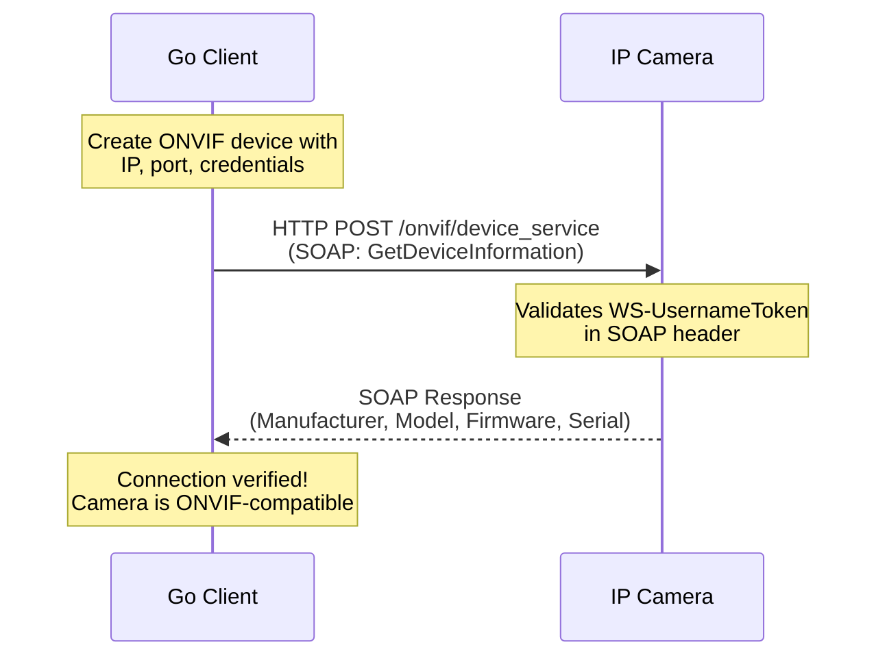

# 01 - Setup and Connection

## What This Section Covers

The foundation of all ONVIF work: establishing a connection to an IP camera using the ONVIF Device service. You will learn how to create a client, authenticate with WS-UsernameToken, and verify that the camera responds to basic ONVIF requests.

## Key Concepts

- **ONVIF Device Service:** Every ONVIF device exposes a Device service endpoint (typically at `/onvif/device_service`). This is the entry point for all communication.
- **SOAP over HTTP:** ONVIF uses SOAP 1.2 messages sent via HTTP POST. The `use-go/onvif` library abstracts this, but understanding the underlying protocol helps with debugging.
- **WS-UsernameToken:** ONVIF authentication uses a SOAP security header containing the username, a password digest, a nonce, and a timestamp. The library builds this header automatically.
- **XAddr:** The service address (URL) where a specific ONVIF service can be reached.

## Communication Flow

## What the Go Code Demonstrates

1. Loading camera credentials from a `.env.local` file.
2. Creating an ONVIF `Device` using `onvif.NewDevice()`.
3. Calling `GetDeviceInformation` to verify the connection.
4. Printing the camera's manufacturer, model, and firmware version.
5. Error handling for connection and authentication failures.

## Next Steps

Once you can connect and retrieve device information, proceed to [02 - Device Management](../02-device-management/) to explore the full Device service.
