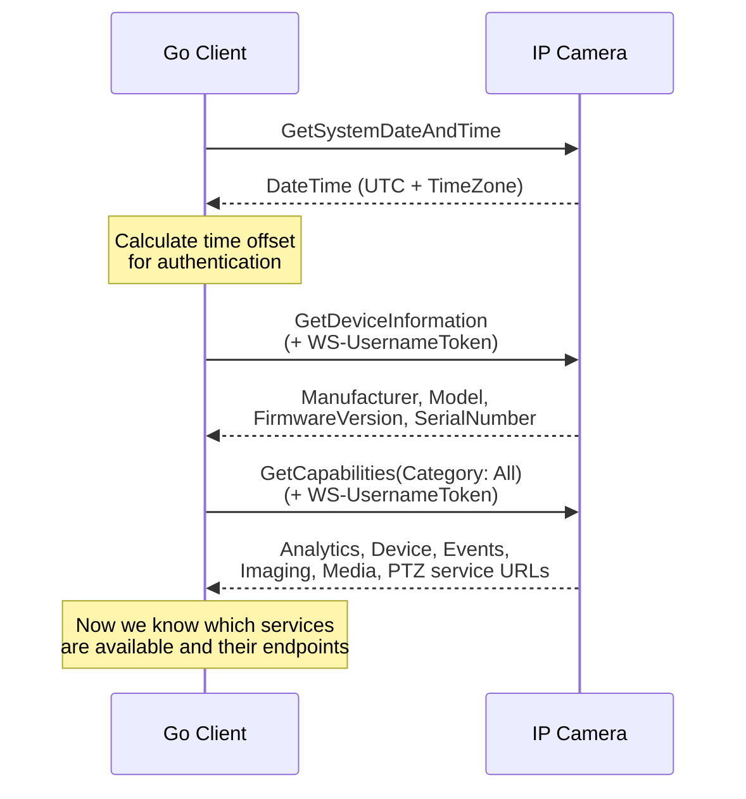

# 02 - Device Management

## What This Section Covers

The Device Management service provides administrative control over an ONVIF device. It is the most fundamental service — every ONVIF-conformant device must implement it. Here you will query device capabilities, system information, network configuration, and system date/time.

## Key Concepts

- **GetDeviceInformation:** Returns the manufacturer, model, firmware version, serial number, and hardware ID.
- **GetCapabilities:** Discovers which ONVIF services (Media, PTZ, Events, etc.) the device supports and their endpoint URLs.
- **GetSystemDateAndTime:** Retrieves the device's clock — critical for WS-UsernameToken time synchronization. This call does **not** require authentication.
- **GetNetworkInterfaces:** Returns the device's network configuration (IP addresses, DHCP settings, MAC address).

## Communication Flow

## What the Go Code Demonstrates

1. Calling `GetSystemDateAndTime` without authentication to check the camera's clock.
2. Computing the time offset between client and camera for accurate token generation.
3. Calling `GetDeviceInformation` to retrieve hardware details.
4. Calling `GetCapabilities` with `Category: All` to discover available services.
5. Parsing capability URLs to determine which subsequent tutorial sections apply to your camera.

## Next Steps

With the capability URLs in hand, you can proceed to [03 - Discovery](../03-discovery/) to learn how to find cameras on the network automatically, or jump to [04 - Media](../04-media/) to start working with video streams.
