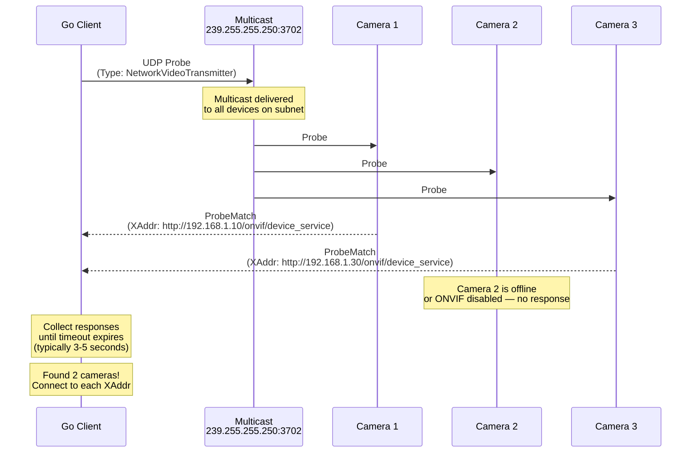

# 03 - Discovery (WS-Discovery)

## What This Section Covers

WS-Discovery allows you to find ONVIF-compatible devices on the local network without knowing their IP addresses in advance. This is how VMS software automatically detects cameras when they are plugged in.

## Key Concepts

- **WS-Discovery:** A protocol for discovering services on a local network using UDP multicast.
- **Probe / ProbeMatch:** The client sends a multicast Probe message; each ONVIF device on the network responds with a ProbeMatch containing its service address.
- **Multicast Address:** Probes are sent to `239.255.255.250:3702` (the standard WS-Discovery multicast group).
- **Scopes:** Devices advertise scopes (metadata like name, location, hardware type) that can be used to filter Probe results.
- **Types:** The Probe specifies which device types to search for. For ONVIF, this is typically `dn:NetworkVideoTransmitter`.

## Communication Flow

## What the Go Code Demonstrates

1. Sending a WS-Discovery Probe using the `use-go/onvif` discovery functions.
2. Setting an appropriate timeout for collecting responses.
3. Parsing ProbeMatch responses to extract device addresses (XAddrs).
4. Extracting device scopes (name, location, hardware info) from the response.
5. Connecting to each discovered device using the returned XAddr.

## Common Issues

- **No devices found:** Check firewall settings for UDP port 3702 and ensure multicast routing is enabled. See the [Troubleshooting Guide](../docs/troubleshooting.md#ws-discovery-not-finding-cameras).
- **Duplicate responses:** Some cameras send multiple ProbeMatches. Deduplicate by XAddr.
- **Wi-Fi:** Multicast is unreliable over Wi-Fi. Use a wired connection for discovery.

## Next Steps

Now that you can find cameras on the network, proceed to [04 - Media](../04-media/) to learn how to retrieve video streams from those cameras.
