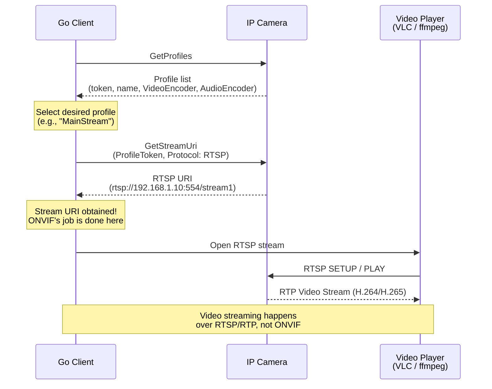

# 04 - Media Service

## What This Section Covers

The Media service is where video streaming begins. You will learn how to retrieve media profiles, get RTSP stream URIs, and understand video/audio encoder configurations. This is the core of any VMS application.

## Key Concepts

- **Media Profile:** A named configuration bundle that ties together a video source, video encoder, audio source, audio encoder, and optionally PTZ configuration. Most cameras have at least two profiles (e.g., "Profile1" for high-res main stream, "Profile2" for low-res sub stream).
- **GetProfiles:** Returns all media profiles configured on the device.
- **GetStreamUri:** Returns the RTSP URI for a given profile — this is the URL you feed to a video player or recorder.
- **GetSnapshotUri:** Returns an HTTP URL for a single JPEG snapshot from the camera.
- **Video Encoder Configuration:** Settings like resolution, frame rate, bitrate, encoding (H.264/H.265), and GOP length.

## Communication Flow

## What the Go Code Demonstrates

1. Calling `GetProfiles` to list all available media profiles.
2. Inspecting profile details (resolution, encoding, frame rate).
3. Calling `GetStreamUri` to obtain the RTSP URL for a specific profile.
4. Calling `GetSnapshotUri` to obtain a snapshot URL.
5. Calling `GetVideoEncoderConfiguration` to inspect encoding settings.
6. Opening the stream with a Go RTSP library or external player.

## Important Notes

- ONVIF only provides the stream URI — the actual video transport uses RTSP/RTP, which is a separate protocol.
- The RTSP URI may require the same credentials as the ONVIF connection.
- Some cameras limit the number of concurrent RTSP sessions (typically 2-4).

## Next Steps

With video streaming working, proceed to [05 - PTZ](../05-ptz/) to learn how to control the camera's pan, tilt, and zoom, or to [06 - Events](../06-events/) to receive motion detection alerts.
