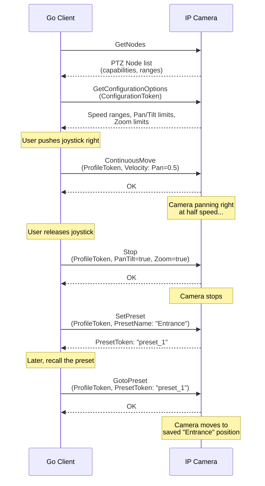

# 05 - PTZ Service

## What This Section Covers

The PTZ (Pan-Tilt-Zoom) service lets you control motorized camera movement. You will learn how to discover PTZ capabilities, move the camera in different modes, manage presets, and implement smooth camera control suitable for VMS operator interfaces.

## Key Concepts

- **PTZ Node:** Represents a physical or digital PTZ mechanism. Use `GetNodes` to discover available nodes.
- **PTZ Configuration:** Links a PTZ node to a media profile. Each profile can have one PTZ configuration.
- **Movement Modes:**
  - **ContinuousMove:** Camera moves at a given speed until `Stop` is called. Best for joystick-style control.
  - **RelativeMove:** Camera moves a specified distance from its current position. Good for button-based nudging.
  - **AbsoluteMove:** Camera moves to an exact position. Used for preset recall and automated patrol.
- **Presets:** Saved camera positions that can be recalled by name or token (e.g., "Entrance", "Parking Lot").
- **Pan/Tilt range:** Normalized to -1.0 to 1.0. **Zoom range:** Normalized to 0.0 to 1.0.

## Communication Flow

## What the Go Code Demonstrates

1. Calling `GetNodes` to discover PTZ capabilities.
2. Calling `GetConfigurationOptions` to learn valid speed and position ranges.
3. Implementing `ContinuousMove` with velocity control (pan, tilt, zoom).
4. Calling `Stop` to halt camera movement.
5. Using `RelativeMove` for incremental position changes.
6. Using `AbsoluteMove` for exact positioning.
7. Creating, listing, and recalling presets with `SetPreset`, `GetPresets`, and `GotoPreset`.

## Common Issues

- **Camera doesn't move:** Verify the profile has a PTZ configuration attached. Fixed cameras will not have PTZ nodes.
- **Erratic movement:** Check that velocity values are within the ranges returned by `GetConfigurationOptions`.
- **Digital PTZ (ePTZ):** Some fixed cameras support software-based zoom and pan within the image. This works through the same PTZ service but with limited range.

## Next Steps

Proceed to [06 - Events](../06-events/) to learn how to receive real-time notifications from the camera (motion detection, tampering, etc.).
