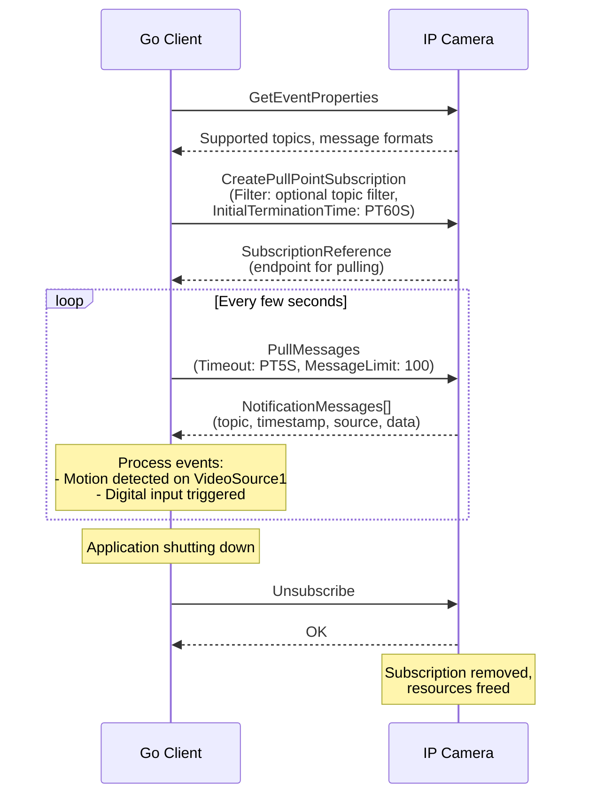

# 06 - Event Service

## What This Section Covers

The Event service lets your application receive real-time notifications from the camera — motion detection, tampering alerts, digital input triggers, and more. ONVIF supports two event delivery methods: **PullPoint** (polling) and **Basic Notification** (push). This tutorial focuses on PullPoint, which is simpler and works through firewalls.

## Key Concepts

- **PullPoint Subscription:** The client creates a subscription on the camera, then periodically polls (pulls) for new events. No inbound connection from the camera is needed.
- **CreatePullPointSubscription:** Establishes a subscription and returns an endpoint address for pulling messages.
- **PullMessages:** Retrieves queued events from the subscription endpoint. Blocks until events are available or a timeout is reached.
- **Unsubscribe:** Cleanly terminates the subscription, freeing camera resources.
- **Event Topics:** Events are categorized by topic (e.g., `tns1:RuleEngine/CellMotionDetector/Motion`, `tns1:Device/Trigger/DigitalInput`).
- **Subscription Timeout:** Subscriptions expire after a configured duration. Use `Renew` to extend them.

## Communication Flow

## What the Go Code Demonstrates

1. Calling `GetEventProperties` to discover supported event topics.
2. Creating a PullPoint subscription with `CreatePullPointSubscription`.
3. Implementing a polling loop with `PullMessages`.
4. Parsing notification messages to extract event topic, timestamp, source, and data.
5. Filtering events by topic (e.g., only motion detection).
6. Handling subscription renewal before timeout.
7. Cleanly unsubscribing when the application exits.

## Event Topics Reference

| Topic | Description |
|-------|-------------|
| `tns1:RuleEngine/CellMotionDetector/Motion` | Motion detected in a defined region |
| `tns1:VideoSource/MotionAlarm` | Global motion alarm on a video source |
| `tns1:Device/Trigger/DigitalInput` | Physical input trigger (door sensor, etc.) |
| `tns1:Device/HardwareFailure` | Hardware malfunction detected |
| `tns1:VideoSource/ImageTooBlurry` | Image quality degradation |

> Note: Available topics vary by camera model and firmware. Always check `GetEventProperties` first.

## Next Steps

Proceed to [07 - Imaging](../07-imaging/) to learn how to adjust camera image settings (brightness, focus, exposure).
