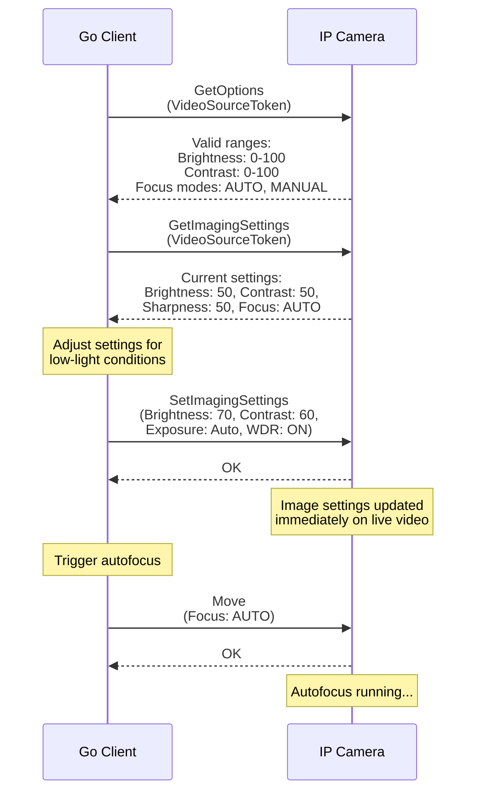

# 07 - Imaging Service

## What This Section Covers

The Imaging service controls the camera's image sensor settings — brightness, contrast, sharpness, focus, exposure, white balance, and more. These settings affect the visual quality of the video stream and are essential for optimizing image quality in different lighting conditions.

## Key Concepts

- **VideoSourceToken:** Imaging settings are applied per video source (physical sensor), not per media profile.
- **GetImagingSettings:** Retrieves current image settings for a video source.
- **SetImagingSettings:** Applies new image settings. Changes take effect immediately on the live video.
- **GetOptions:** Returns the valid ranges and options for each imaging parameter (min/max brightness, available focus modes, etc.).
- **Move (Focus):** For cameras with motorized focus, triggers an autofocus operation or manual focus adjustment.

## Communication Flow

## What the Go Code Demonstrates

1. Using `GetOptions` to discover valid ranges for each imaging parameter.
2. Calling `GetImagingSettings` to read the current configuration.
3. Modifying settings (brightness, contrast, sharpness, saturation) with `SetImagingSettings`.
4. Adjusting exposure settings (mode, min/max exposure time, gain).
5. Configuring white balance (auto vs. manual with custom color temperature).
6. Enabling Wide Dynamic Range (WDR) for high-contrast scenes.
7. Triggering autofocus or setting manual focus with the `Move` operation.

## Common Settings

| Parameter | Typical Range | Description |
|-----------|---------------|-------------|
| Brightness | 0 - 100 | Overall image brightness |
| Contrast | 0 - 100 | Difference between light and dark areas |
| Sharpness | 0 - 100 | Edge enhancement level |
| Saturation | 0 - 100 | Color intensity |
| Exposure Mode | AUTO / MANUAL | Automatic or manual exposure control |
| WDR | ON / OFF | Wide Dynamic Range for mixed lighting |
| IRCutFilter | AUTO / ON / OFF | Infrared cut filter for day/night modes |

## Next Steps

Proceed to [08 - Recording](../08-recording/) to learn how to work with on-device recording and playback (Profile G).
