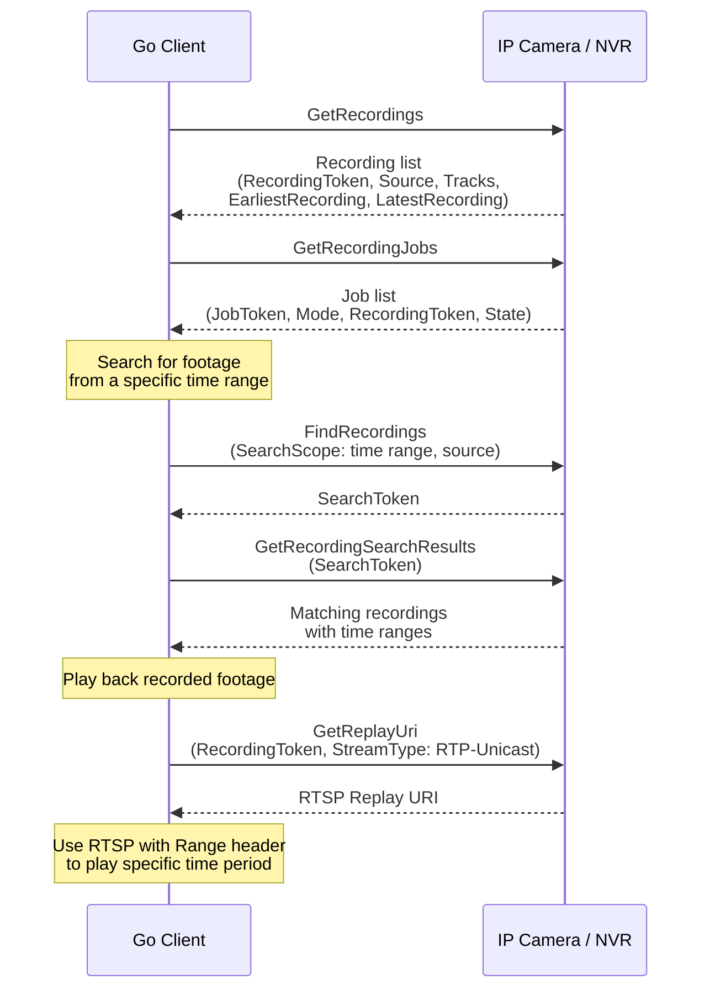

# 08 - Recording Service (Profile G)

## What This Section Covers

The Recording service manages on-device or NVR-based video storage. Part of ONVIF **Profile G**, it allows you to create recordings, manage recording jobs, search recorded video, and play back footage. This is essential for building VMS applications that need to store and retrieve video evidence.

## Key Concepts

- **Recording:** A logical container for recorded media tracks (video, audio, metadata). Each recording has a source and configuration.
- **RecordingJob:** Controls when and how recording happens. A job links a recording to a receiver (the video source).
- **Track:** An individual media stream within a recording (e.g., video track, audio track, metadata track).
- **GetRecordings:** Lists all recordings on the device.
- **GetRecordingJobs:** Lists active recording jobs and their states.
- **FindRecordings / GetRecordingSearchResults:** Search for recordings matching time ranges or other criteria.
- **Replay Service:** Used alongside Recording to play back stored footage via RTSP.

## Communication Flow

## What the Go Code Demonstrates

1. Calling `GetRecordings` to list all available recordings.
2. Inspecting recording details — tracks, time range, source information.
3. Calling `GetRecordingJobs` to see active recording configurations.
4. Using `FindRecordings` and `GetRecordingSearchResults` to search by time range.
5. Obtaining a replay URI with `GetReplayUri` for video playback.
6. Understanding the relationship between recordings, jobs, and tracks.

## Profile G Support

Not all cameras support Profile G. Recording capabilities are more commonly found on:
- NVRs (Network Video Recorders)
- Cameras with SD card slots and on-board recording
- Enterprise-grade cameras with edge storage

Check `GetCapabilities` or `GetServices` to verify that the Recording service is available on your device.

## Next Steps

You now have experience with all the major ONVIF services. Proceed to [09 - Real-World Projects](../09-real-world/) to see how these services are combined into practical VMS applications.
