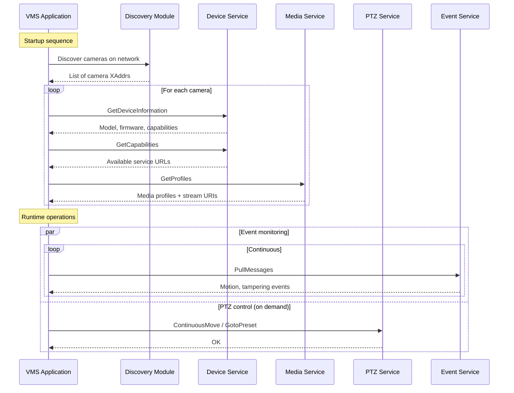

# 09 - Real-World VMS Projects

## What This Section Covers

This section brings together everything from the previous tutorials into practical, production-inspired applications. You will build two projects that demonstrate how to combine multiple ONVIF services into cohesive VMS software.

## Projects

### Camera Manager (`camera-manager/`)

A multi-camera management tool that:
- Discovers all ONVIF cameras on the network using WS-Discovery
- Connects to each camera and retrieves device information
- Lists media profiles and stream URIs for all cameras
- Provides a unified interface for PTZ control across cameras
- Saves and recalls PTZ presets

### Stream Monitor (`stream-monitor/`)

A stream health monitoring service that:
- Monitors RTSP stream availability for a list of cameras
- Subscribes to camera events (motion, tampering, hardware failure)
- Periodically checks imaging settings and camera status
- Logs events and generates alerts when streams go down
- Demonstrates graceful subscription management and error recovery

## Architecture



## Key Patterns Demonstrated

1. **Connection pooling:** Maintaining persistent connections to multiple cameras.
2. **Capability-based feature detection:** Only using services the camera actually supports.
3. **Concurrent event polling:** Running PullPoint subscriptions for multiple cameras in separate goroutines.
4. **Graceful shutdown:** Unsubscribing from events and closing connections cleanly on application exit.
5. **Error recovery:** Handling camera disconnections, subscription timeouts, and network interruptions.
6. **Configuration management:** Loading camera lists and credentials from configuration files.

## Running the Projects

```bash
# Camera Manager
cd camera-manager
cp ../../.env.example .env.local
# Edit .env.local with your network details
go run main.go

# Stream Monitor
cd stream-monitor
cp ../../.env.example .env.local
go run main.go
```

## What You Should Take Away

After completing this section, you should be able to:
- Design a Go application that manages multiple ONVIF cameras simultaneously.
- Handle the asynchronous nature of camera events using goroutines and channels.
- Build robust error handling for real-world network conditions.
- Structure ONVIF-based applications for maintainability and extensibility.
