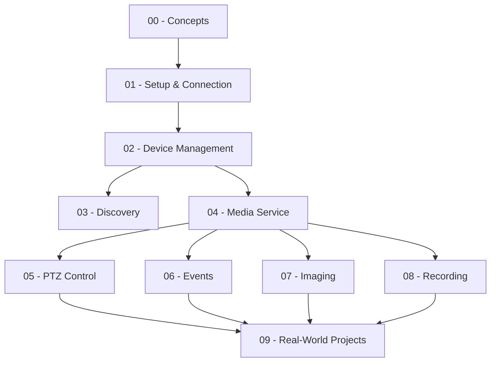

# Go ONVIF Tutorial: Building VMS Software with use-go/onvif

A hands-on, progressive tutorial for building Video Management System (VMS) software in Go using the [use-go/onvif](https://github.com/use-go/onvif) library. Each section builds on the previous one, taking you from basic camera connectivity to real-world multi-service VMS patterns.

## Who Is This For?

- Go developers who want to integrate IP cameras into their applications
- Engineers building video surveillance or monitoring systems
- Anyone working with ONVIF-compatible devices (cameras, NVRs, encoders)

## Prerequisites

- **Go 1.21+** installed ([download](https://go.dev/dl/))
- Access to an **ONVIF-compatible IP camera or NVR** on your network
- Basic understanding of Go modules, HTTP, and XML/SOAP concepts

## Quick Start

```bash
# 1. Clone the repository
git clone https://github.com/your-org/go-onvif-tutorial.git
cd go-onvif-tutorial

# 2. Copy the environment template and fill in your camera details
cp .env.example .env.local

# 3. Edit .env.local with your camera's IP, port, username, and password
#    CAMERA_IP=192.168.1.100
#    CAMERA_PORT=80
#    CAMERA_USER=admin
#    CAMERA_PASS=your_password

# 4. Run the first example to verify connectivity
cd 01-setup
go run main.go
```

## Environment Setup

Create a `.env.local` file in the project root with your camera credentials:

```env
CAMERA_IP=192.168.1.100
CAMERA_PORT=80
CAMERA_USER=admin
CAMERA_PASS=your_password
CAMERA_XADDR=http://192.168.1.100:80/onvif/device_service
```

> **Security Note:** `.env.local` is listed in `.gitignore`. Never commit real camera credentials.

## Learning Roadmap

Follow the sections in order. Each one introduces a new ONVIF service and builds on concepts from earlier sections.



| # | Section | What You Will Learn |
|---|---------|---------------------|
| 00 | [Concepts](./00-concepts/) | ONVIF architecture, SOAP basics, WS-Security, profiles overview |
| 01 | [Setup](./01-setup/) | Connecting to a camera, creating a Device client, verifying ONVIF support |
| 02 | [Device Management](./02-device-management/) | Querying device info, capabilities, system date/time, network settings |
| 03 | [Discovery](./03-discovery/) | WS-Discovery multicast probing, finding cameras on the network |
| 04 | [Media](./04-media/) | Media profiles, stream URIs, snapshot URIs, video encoder configs |
| 05 | [PTZ](./05-ptz/) | Pan-Tilt-Zoom control, presets, continuous/relative/absolute moves |
| 06 | [Events](./06-events/) | PullPoint subscriptions, motion detection events, event filtering |
| 07 | [Imaging](./07-imaging/) | Brightness, contrast, focus, exposure, white balance settings |
| 08 | [Recording](./08-recording/) | Profile G recording, playback, recording jobs, track configuration |
| 09 | [Real-World Projects](./09-real-world/) | Camera manager and stream monitor — combining everything together |

## Project Structure

```
go-onvif-tutorial/
├── 00-concepts/          # ONVIF theory and background
├── 01-setup/             # Camera connection basics
├── 02-device-management/ # Device service operations
├── 03-discovery/         # WS-Discovery
├── 04-media/             # Media profiles and streaming
├── 05-ptz/               # PTZ control
├── 06-events/            # Event handling
├── 07-imaging/           # Image settings
├── 08-recording/         # Recording and playback
├── 09-real-world/        # Full VMS examples
│   ├── camera-manager/   #   Multi-camera management tool
│   └── stream-monitor/   #   Stream health monitoring
├── docs/                 # Additional documentation
│   ├── specs/            #   ONVIF specification references
│   ├── troubleshooting.md
│   └── camera-compatibility.md
└── internal/
    └── config/           # Shared configuration loading
```

## Resources

- [ONVIF Official Website](https://www.onvif.org/)
- [ONVIF Specifications](https://www.onvif.org/specs/core/ONVIF-Core-Specification.pdf)
- [use-go/onvif Library](https://github.com/use-go/onvif)
- [Troubleshooting Guide](./docs/troubleshooting.md)
- [Camera Compatibility Notes](./docs/camera-compatibility.md)

## License

This tutorial is provided for educational purposes.
